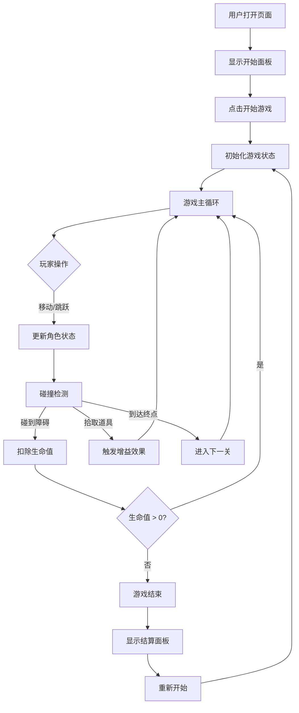

## 1. 产品概述

一款基于 Web 的横版卷轴跳跃冒险游戏，玩家操控角色在高低错落的平台间跳跃移动，躲避沿途障碍并拾取增益道具。采用前后端分离架构，游戏逻辑运行在 9758 端口，交互界面运行在 3758 端口，通过 WebSocket 实时同步游戏状态。

- 核心目标：在有限生命值内尽可能通关更多关卡，挑战高分
- 目标用户：休闲游戏爱好者，支持桌面端和移动端
- 市场价值：零门槛即开即玩，可作为嵌入式小游戏部署

## 2. 核心功能

### 2.1 功能模块

1. **游戏主界面**：Canvas 游戏场景、HUD 状态栏、开始/暂停/结算面板
2. **角色控制模块**：左右移动、跳跃、物理重力模拟
3. **关卡生成模块**：程序化生成平台、障碍、道具，关卡递增难度
4. **碰撞检测模块**：角色与平台/障碍/道具的碰撞判定
5. **道具增益系统**：回血、加速、护盾、双倍分数等效果
6. **进度结算模块**：关卡完成、游戏结束、得分统计面板

### 2.2 页面详情

| 页面名称 | 模块名称 | 功能描述 |
|-----------|-------------|---------------------|
| 游戏主界面 | 开始面板 | 游戏标题、开始按钮、操作说明 |
| 游戏主界面 | Canvas 场景 | 横向滚动的平台、角色、障碍、道具渲染 |
| 游戏主界面 | HUD 状态栏 | 左上角生命值、右上角分数、顶部当前关卡 |
| 游戏主界面 | 触屏控制区 | 移动端底部左右移动 + 跳跃虚拟按键 |
| 游戏主界面 | 结算面板 | 游戏结束时显示最终得分、关卡数、重新开始按钮 |
| 游戏主界面 | 暂停面板 | 暂停时显示继续/重新开始选项 |

## 3. 核心流程

```
用户打开页面 → 显示开始面板 → 点击开始游戏
→ 初始化游戏状态（角色、关卡1、初始生命值3）
→ 游戏循环（物理更新 → 碰撞检测 → 状态同步 → 前端渲染）
→ 玩家操作（移动/跳跃）→ 躲避障碍/拾取道具
→ 到达关卡终点 → 进入下一关（场景变长、障碍增多）
→ 生命值归零 → 弹出结算面板 → 重新开始/返回主页
```



## 4. 用户界面设计

### 4.1 设计风格

- **主色调**：深邃夜空蓝 `#0f172a` 为背景，霓虹青 `#22d3ee` 为强调色，活力橙 `#f97316` 为警示色，翠绿 `#10b981` 为增益色
- **辅助色**：平台使用渐变金属感，角色采用赛博朋克风格造型
- **按钮风格**：圆角矩形 + 发光边框悬停效果，点击时微缩放
- **字体**：标题使用 `Orbitron` 科技感字体，正文使用 `JetBrains Mono` 等宽字体
- **布局风格**：全屏沉浸式 Canvas，HUD 浮于场景之上，面板采用毛玻璃半透明效果
- **视觉氛围**：星空粒子背景 + 扫描线滤镜 + 霓虹发光效果

### 4.2 页面设计概览

| 页面名称 | 模块名称 | UI 元素 |
|-----------|-------------|-------------|
| 游戏主界面 | 开始面板 | 居中大标题（霓虹发光动画）、开始按钮（呼吸灯效果）、操作说明图标 |
| 游戏主界面 | HUD 状态栏 | 心形生命值图标（红色渐变）、分数数字（带千分位）、关卡徽章（胶囊形） |
| 游戏主界面 | Canvas 场景 | 视差滚动背景层、平台（渐变多边形）、角色（精灵/几何体）、障碍物（红色警告标识）、道具（发光旋转） |
| 游戏主界面 | 触屏控制区 | 左侧圆形左右按键、右侧圆形跳跃按键（半透明 + 按下高亮） |
| 游戏主界面 | 结算面板 | 毛玻璃背景、最终分数（大号数字）、通关数、统计数据、重新开始按钮 |

### 4.3 响应式设计

- **桌面优先**：Canvas 自适应窗口尺寸，保持 16:9 比例
- **移动端适配**：检测到触屏设备自动显示虚拟按键，HUD 尺寸适配 DPR
- **输入检测**：自动支持键盘（方向键/WASD/空格）+ 鼠标点击 + 触屏滑动/点击
- **横竖屏**：强制横屏模式，竖屏时提示旋转设备

### 4.4 动效设计

- 角色跳跃时带拉伸形变，落地时挤压反馈
- 道具拾取时粒子爆炸效果 + 分数飘字
- 关卡切换时场景快速滑动过渡
- 生命值变化时心跳动画
- 面板弹出时缩放 + 淡入组合动画
