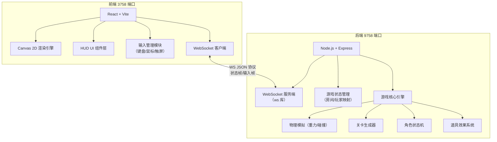

## 1. 架构设计



## 2. 技术栈说明

- **前端**：React@18 + Vite@5 + Canvas 2D API，无需额外游戏引擎
- **后端**：Node.js@20 + Express@4 + ws@8（WebSocket 库）
- **初始化工具**：Vite 脚手架创建前端，手动搭建 Node 后端
- **通信协议**：WebSocket 双向 JSON 消息
- **状态同步**：服务端权威模型（Server Authoritative），客户端插值渲染
- **无数据库**：所有状态内存存储，无需持久化

## 3. 端口与服务

| 端口 | 服务类型 | 职责 |
|-------|---------|------|
| 9758 | HTTP + WebSocket | 游戏逻辑服务：物理模拟、碰撞检测、关卡生成、状态广播 |
| 3758 | HTTP (Vite Dev Server) | 前端静态资源服务：React 应用、Canvas 渲染、UI 交互 |

## 4. WebSocket 协议定义

### 4.1 客户端 → 服务端消息

```typescript
// 玩家输入帧（每 16ms 发送一次）
interface InputMessage {
  type: 'input';
  data: {
    left: boolean;
    right: boolean;
    jump: boolean;
    jumpPressed: boolean; // 边沿触发
  };
}

// 游戏控制命令
interface ControlMessage {
  type: 'start' | 'restart' | 'pause' | 'resume';
}

type ClientMessage = InputMessage | ControlMessage;
```

### 4.2 服务端 → 客户端消息

```typescript
// 完整游戏状态快照（每 16ms 广播）
interface StateMessage {
  type: 'state';
  data: GameState;
}

// 事件通知（碰撞、道具、关卡切换等）
interface EventMessage {
  type: 'event';
  data: {
    kind: 'pickup' | 'damage' | 'levelup' | 'gameover';
    payload: any;
  };
}

type ServerMessage = StateMessage | EventMessage;
```

### 4.3 核心数据结构

```typescript
interface GameState {
  status: 'idle' | 'playing' | 'paused' | 'gameover';
  level: number;
  score: number;
  health: number;
  maxHealth: number;
  cameraX: number;
  player: Player;
  platforms: Platform[];
  obstacles: Obstacle[];
  powerups: Powerup[];
  levelEndX: number;
  activeEffects: ActiveEffect[];
}

interface Player {
  x: number;
  y: number;
  vx: number;
  vy: number;
  width: number;
  height: number;
  onGround: boolean;
  facing: 1 | -1;
}

interface Platform {
  id: string;
  x: number;
  y: number;
  width: number;
  height: number;
  type: 'normal' | 'moving';
}

interface Obstacle {
  id: string;
  x: number;
  y: number;
  width: number;
  height: number;
  type: 'spike' | 'saw' | 'falling';
}

interface Powerup {
  id: string;
  x: number;
  y: number;
  width: number;
  height: number;
  type: 'health' | 'speed' | 'shield' | 'double';
  collected: boolean;
}

interface ActiveEffect {
  type: Powerup['type'];
  remaining: number; // 秒
}
```

## 5. 游戏引擎核心参数

| 参数 | 值 | 说明 |
|------|-----|------|
| 重力加速度 | 1800 px/s² | 像素每秒平方 |
| 跳跃初速度 | -750 px/s | 向上为负 |
| 移动速度 | 320 px/s | 水平基础速度 |
| 加速道具倍率 | 1.6x | 移动速度倍增 |
| 初始生命值 | 3 | 心形图标数量 |
| 关卡 1 长度 | 4000 px | 随关卡递增 |
| 每关长度增量 | +1500 px | 线性增长 |
| 障碍密度增长 | 每关 +25% | 指数增长 |
| 无敌帧时长 | 1.2 秒 | 受伤后短暂无敌 |
| 逻辑帧率 | 60 Hz | 固定时间步长 |
| 网络帧率 | 60 Hz | 状态同步频率 |

## 6. 模块目录结构

```
lp0068/
├── .trae/documents/           # 需求与技术文档
├── backend/                   # 9758 端口 - 游戏逻辑服务
│   ├── package.json
│   ├── src/
│   │   ├── server.ts          # Express + WS 启动入口
│   │   ├── game/
│   │   │   ├── GameEngine.ts  # 游戏主循环、状态管理
│   │   │   ├── Physics.ts     # 重力、碰撞检测
│   │   │   ├── LevelGenerator.ts  # 程序化关卡生成
│   │   │   ├── Player.ts      # 角色状态与行为
│   │   │   └── PowerupSystem.ts   # 道具效果管理
│   │   └── types/
│   │       └── shared.ts      # 前后端共享类型定义
│   └── tsconfig.json
├── frontend/                  # 3758 端口 - 交互界面
│   ├── package.json
│   ├── vite.config.ts
│   ├── src/
│   │   ├── main.tsx
│   │   ├── App.tsx
│   │   ├── game/
│   │   │   ├── GameRenderer.ts    # Canvas 2D 渲染器
│   │   │   ├── InputManager.ts    # 键鼠/触屏输入统一处理
│   │   │   ├── NetworkClient.ts   # WebSocket 封装
│   │   │   └── StateInterpolator.ts  # 状态插值
│   │   ├── components/
│   │   │   ├── HUD.tsx            # 生命值/分数/关卡
│   │   │   ├── StartPanel.tsx     # 开始面板
│   │   │   ├── GameOverPanel.tsx  # 结算面板
│   │   │   ├── PausePanel.tsx     # 暂停面板
│   │   │   └── TouchControls.tsx  # 触屏虚拟按键
│   │   └── styles/
│   │       └── global.css         # 全局样式与动画
│   └── tsconfig.json
└── README.md
```
